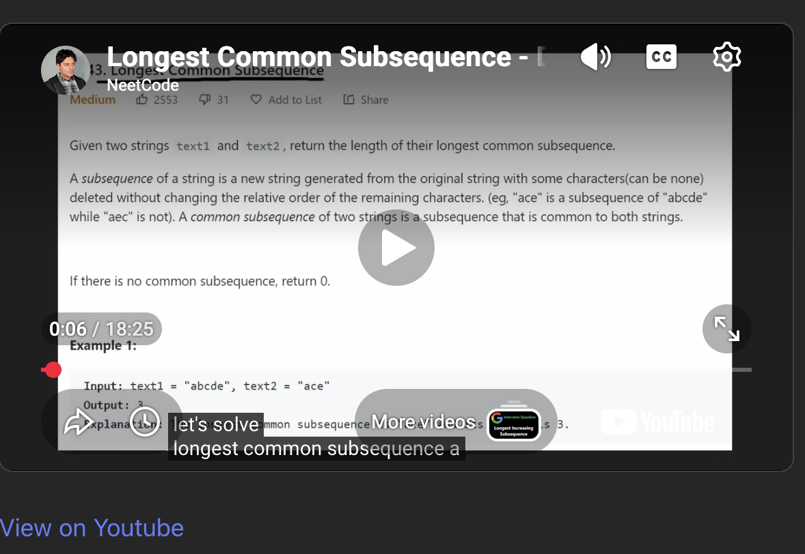
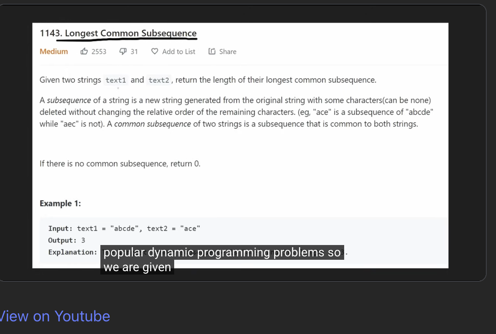

# YouTube Embedded Player - Quick Fade Controls

A lightweight browser extension that improves the user experience of embedded YouTube players by automatically hiding the control overlay after a short delay.

## What It Does

When you pause an embedded YouTube video, the control overlay (play button, progress bar, etc.) sometimes stays visible indefinitely. This extension automatically hides the overlay after:

- **1 second** when the video is paused
- **3 seconds** when the video is playing
- **100ms** when you move your mouse away from the controls
- **Spacebar press** makes controls visible when pausing and then disappears after a short delay

This creates a cleaner viewing experience while keeping controls easily accessible when needed.

Before adding the extension, when pausing the video the overlay continues to display until the video is resumed.


After adding the extension, the overlay is removed after a delay after pausing the video.


## Features

- Automatic fade-out of player controls
- Works only on embedded YouTube players (not youtube.com)
- Smart hover detection - controls stay visible when you need them
- Spacebar event listener to keep controls visible
- Per-tab metrics tracking showing fade-in add/remove counts
- Per-tab state (metrics reset on page reload or tab close)
- Lightweight and efficient
- Privacy-focused - runs entirely locally, no data collection

## Installation

### Download or Clone

```bash
git clone https://github.com/nbhat100/remove-youtube-fadein-overlay.git
```

### Chrome/Edge/Brave

1. Navigate to `chrome://extensions/`
2. Enable "Developer mode" (toggle in top-right corner)
3. Click "Load unpacked"
4. Select the extension folder

### Firefox

1. Navigate to `about:debugging#/runtime/this-firefox`
2. Click "Load Temporary Add-on"
3. Select any file in the project folder

The extension is now active on all embedded YouTube players.

## Usage

### Viewing Metrics

Click the extension icon in your browser toolbar  (MV3 compatible)

### Resetting Metrics

Click the "Reset counts" button in the popup to clear the metrics for the current tab.

## File Structure

```
remove-youtube-fadein-overlay/
├── content.js          # Main script injected into YouTube embed pages
├── background.js       # Service worker managing per-tab metrics
├── popup.html          # Extension popup UI
├── popup.js            # Popup logic for displaying and resetting metrics
├── README.md           # This file
└── icons/              # Includes icon PNGs for browser extension images
    ├── icon16.png      # Toolbar icon (16x16)
    ├── icon48.png      # Extension page icon (48x48)
    ├── icon128.png     # Web Store icon (128x128)
```

## How It Works

### Content Script (content.js)

The content script runs on embedded YouTube pages and:

1. Uses a `MutationObserver` to detect when the `fadein` class is added to the control overlay
2. Tracks the count of additions and removals
3. Sends metrics updates to the background service worker
4. Checks if the video is paused or playing
5. Sets an appropriate timeout (1s for paused, 3s for playing)
6. Removes the `fadein` class after the delay, hiding the overlay
7. Responds to mouse movement and spacebar presses to keep controls visible

### Background Service Worker (background.js)

Manages per-tab metric tracking:

1. Maintains a `Map` of metrics indexed by tab ID
2. Receives `UPDATE_METRICS` messages from content scripts
3. Receives `GET_METRICS` requests from the popup
4. Cleans up metrics when tabs are closed
5. Handles metric resets on user request

### Popup (popup.html & popup.js)

Provides a UI to view and manage metrics:

1. Displays the current tab's fade-in add/remove counts
2. Allows resetting metrics for the current tab
3. Communicates with the background service worker via message passing

### Message-Based Architecture

The extension uses Chrome's `chrome.runtime.sendMessage()` for inter-component communication:

- **UPDATE_METRICS**: Content script → Background (metric updates)
- **GET_METRICS**: Popup → Background (retrieve current metrics)
- **RESET_METRICS**: Popup → Background (reset tab metrics)

## Compatibility

- Chrome, Edge, Brave (Chromium-based browsers) - Manifest V3
- Firefox - Compatible with MV2 format
- Works on embedded YouTube players (`youtube.com/embed/`)
- Does not affect the main YouTube website

## Permissions

The extension requires only the `tabs` permission to:

- Query the active tab to associate metrics with the correct tab ID
- Track metrics independently per tab

**No storage permission is used.** All metrics are stored in-memory and are cleared when:

- The page is reloaded
- The tab is closed
- The user clicks "Reset counts" in the popup

## Privacy

This extension:
- Runs entirely locally in your browser
- Does not use persistent storage (metrics are per-tab, in-memory only)
- Does not collect, store, or transmit any data beyond the current session
- Only requires the `tabs` permission for metric tracking
- Only affects embedded YouTube players you visit

## Contributing

Issues and pull requests are welcome! Feel free to suggest improvements or report bugs.

## Disclaimer

This is an independent project and is not affiliated with, endorsed by, or connected to YouTube or Google in any way.